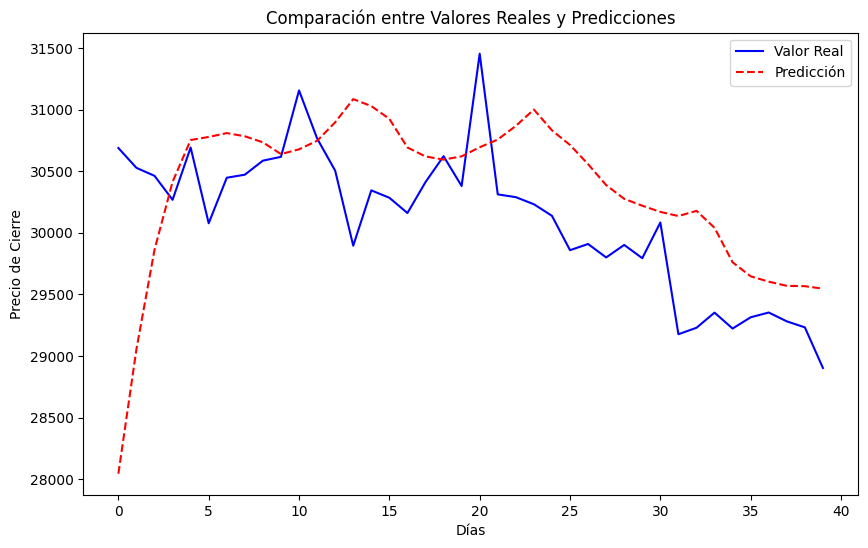
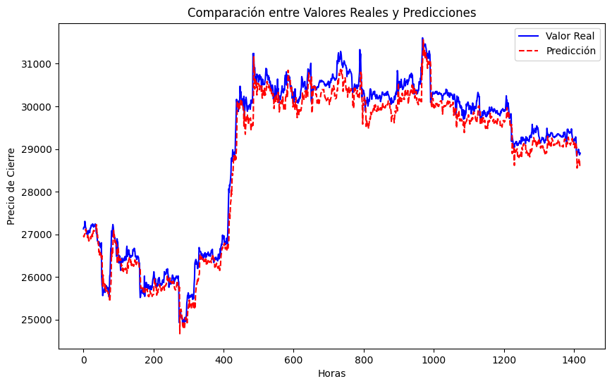
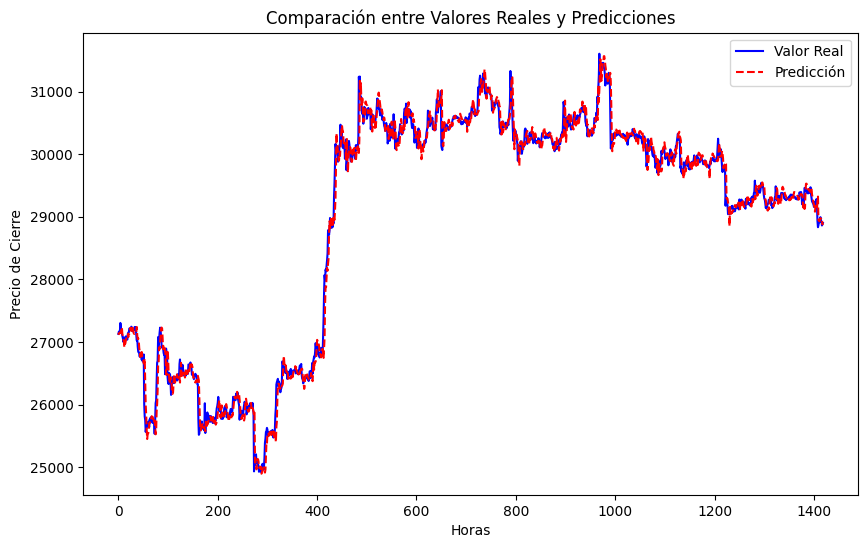

# ML-Prediction of Bitcoin prices
 
En este repositorio se guardan los notebooks para la tarea de predicción del precio de bitcoin.

## Dataset y su preprocesamiento

El dataset utilizado fue tomado de https://www.kaggle.com/datasets/jkraak/bitcoin-price-dataset. Este dataset contenía el precio de apertura y cierre del bitcoin por minuto desde el agosto del 2017 hasta julio del 2023.

Se realizron 2 enfoques para predecir el precio de cierre del bitcoin. 

Se agruparon los precios de bitcoin agrupando los registros guardados por minutos en registros obtenidos por hora y por dia.

## Técnicas utilizadas

Se entrenaron distintos modelos para el aprendizaje incluyendo:

- Regresion lineal
- SVM
- GRU
- LSTM

Los parametros de entrenamiento pueden verificarse en los archivos ipynb.

Tras entrenar los modelos se observó que los mejores modelos se obtenían con la data agrupada por hora.

### Resultados obtenidos con GRU y datos agrupados por día

### Resultados obtenidos con GRU y datos agrupados por hora

### Mejores resultados de redes recurrentes con una capa (GRU) 

Nota:
Para nuestro proyecto se utilizó ChatGPT y se tomo como referencia para el código estas fuentes:

https://github.com/rifkyahmadsaputra/Prediction-Bitcoin-Price-with-Gated-Recurrent-Unit-RNN

https://www.kaggle.com/code/meetnagadia/bitcoin-price-prediction-using-lstm

https://github.com/Abhay64/RNN-for-BitCoin-price-prediction
